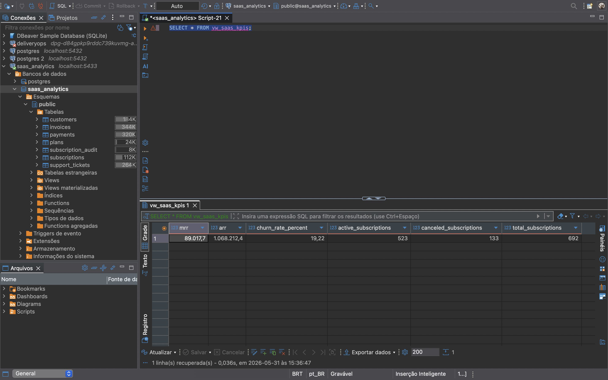
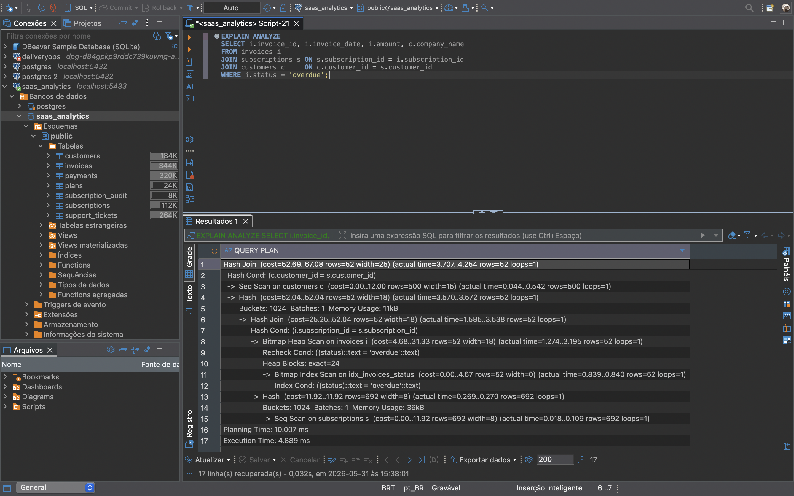
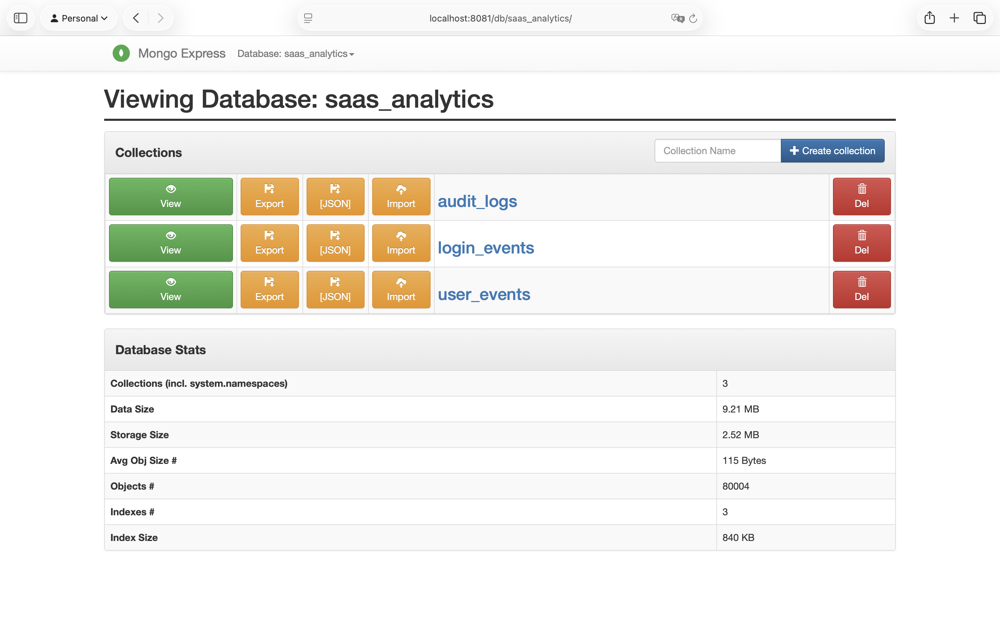
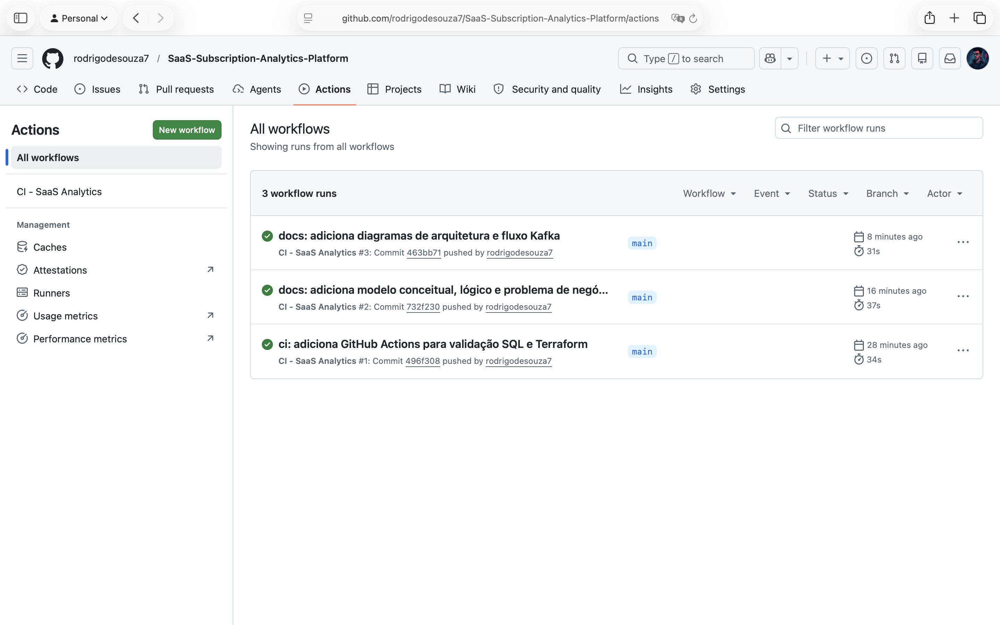

# SaaS Subscription Analytics Platform — Plataforma de Análise de Assinaturas

Plataforma completa de banco de dados para análise operacional e financeira de uma empresa SaaS, aplicando modelagem relacional, SQL avançado, banco documental, ingestão de eventos em tempo real e infraestrutura como código.

---

## Visão Geral

### Problema de Negócio

Empresas SaaS dependem diretamente da previsibilidade de receita e retenção de clientes. Sem monitoramento adequado, questões críticas ficam sem resposta:

- Quanto de receita recorrente estamos gerando este mês?
- Quais planos têm melhor desempenho?
- Quais clientes têm risco de cancelamento?
- O suporte influencia no churn?
- Qual o impacto financeiro dos upgrades e downgrades?

### Solução

Plataforma de banco de dados com arquitetura híbrida — PostgreSQL para dados transacionais e relacionais, MongoDB para eventos e logs comportamentais, Kafka para ingestão de eventos em tempo real e Terraform para provisionamento automatizado do ambiente.

---

## Tech Stack

### Backend
- **PostgreSQL 16** — banco relacional principal
- **MongoDB 7** — eventos e logs comportamentais

### Ingestão de Eventos
- **Apache Kafka 7.6.0** — streaming de eventos SaaS em tempo real
- **Python 3.14** — producer Kafka

### Infraestrutura
- **Terraform 1.15.5** — infraestrutura como código
- **Docker** — containerização do ambiente completo

### DevOps
- **GitHub Actions** — CI/CD automatizado
- **DBeaver** — administração e queries

---

## Arquitetura do Sistema
Python Producer (kafka/01_kafka_events.py)
↓
Kafka Topic: saas-events
(7 tipos de evento)
↙         ↘
PostgreSQL 16    MongoDB 7
customers      user_events
subscriptions  login_events
invoices       audit_logs
payments
support_tickets
↓
GitHub Actions CI/CD

---

## Modelo de Dados

### Banco Relacional (PostgreSQL)

**customers** — empresas contratantes do SaaS
**plans** — Starter | Professional | Business | Enterprise
**subscriptions** — vínculo cliente/plano com ciclo de vida
**invoices** — faturas mensais por assinatura
**payments** — pagamentos via Credit Card, PIX, Bank Transfer, Boleto
**support_tickets** — tickets de suporte com prioridade e status
**subscription_audit** — auditoria automática de mudanças de status

### Banco Documental (MongoDB)

**user_events** — eventos de uso de funcionalidades
**login_events** — logins por device e localização (50.000 documentos)
**audit_logs** — operações críticas do sistema (30.000 documentos)

### Kafka

**Tópico:** `saas-events`

Eventos disponíveis:
- `USER_SIGNED_UP`
- `SUBSCRIPTION_STARTED`
- `PLAN_UPGRADED`
- `PLAN_DOWNGRADED`
- `PAYMENT_FAILED`
- `FEATURE_USED`
- `SUBSCRIPTION_CANCELLED`

---

## SQL Avançado

### Views
- `vw_active_subscriptions` — assinaturas ativas com plano e cliente
- `vw_saas_kpis` — MRR, ARR, Churn Rate consolidados

### Materialized Views
- `mv_monthly_revenue` — receita agregada por mês
- `mv_customer_retention` — tempo de vida e status por cliente

### Stored Procedures
- `sp_create_subscription()` — criação de assinatura
- `sp_upgrade_plan()` — upgrade de plano com validação
- `sp_cancel_subscription()` — cancelamento com data de encerramento

### Functions
- `fn_calculate_mrr()` — MRR total das assinaturas ativas
- `fn_calculate_churn()` — churn rate percentual
- `fn_customer_monthly_revenue()` — receita mensal por cliente

### Triggers
- `trg_subscription_status_change` — auditoria automática de mudanças de status

### Transactions
- Pagamento, upgrade, downgrade e cancelamento com controle transacional explícito

---

## Métricas SaaS Implementadas

| Métrica | Valor | Implementação |
|---|---|---|
| MRR | R$ 89.017,70 | `fn_calculate_mrr()` |
| ARR | R$ 1.068.212,40 | `vw_saas_kpis` |
| Churn Rate | 19,22% | `fn_calculate_churn()` |
| Assinaturas ativas | 523 | `vw_saas_kpis` |
| Assinaturas canceladas | 133 | `vw_saas_kpis` |

---

## Performance

| Query | Antes | Depois | Melhoria |
|---|---|---|---|
| Assinaturas ativas por plano | 0.677ms | 0.669ms | Seq Scan mantido — volume baixo |
| Faturas em atraso | 1.230ms | 0.697ms | 43% |
| Tickets abertos por prioridade | 0.954ms | 0.454ms | 52% |

**Índices aplicados:**
- `idx_subscriptions_status`
- `idx_subscriptions_customer_plan`
- `idx_invoices_status`
- `idx_invoices_subscription`
- `idx_support_tickets_status_priority`
- `idx_support_tickets_customer`

---

## Volume de Dados

| Fonte | Tabela / Coleção | Registros |
|---|---|---|
| PostgreSQL | customers | 500 |
| PostgreSQL | subscriptions | 691 |
| PostgreSQL | invoices | 3.875 |
| PostgreSQL | payments | 3.303 |
| PostgreSQL | support_tickets | 2.000 |
| MongoDB | user_events | 4 |
| MongoDB | login_events | 50.000 |
| MongoDB | audit_logs | 30.000 |
| Kafka | saas-events | 1.000 |

---

## Screenshots

### KPIs — vw_saas_kpis

### Diagrama ER

### Performance — EXPLAIN ANALYZE

### MongoDB — Coleções

### GitHub Actions — CI/CD

### Arquitetura Geral

### Fluxo Kafka

---

## CI/CD Pipeline

GitHub Actions executado em todo push/PR para `main`:

1. Provisiona PostgreSQL em container
2. Executa DDL completo
3. Insere dados de amostra
4. Executa functions, procedures, triggers e views
5. Valida métricas — `fn_calculate_mrr()` e `fn_calculate_churn()`
6. Valida Terraform — `terraform init` e `terraform validate`

**Status:** CI passing ✅

---

## Como Reproduzir

### Pré-requisitos
- Docker Desktop
- Python 3.x
- Terraform
- DBeaver (opcional)

### 1. Clonar repositório
git clone https://github.com/rodrigodesouza7/SaaS-Subscription-Analytics-Platform.git
cd SaaS-Subscription-Analytics-Platform

### 2. Subir o ambiente
cd docker
docker compose up -d

### 3. Executar DDL
Abrir sql/ddl/01_create_tables.sql no DBeaver e executar

### 4. Popular os dados
Executar sql/dml/01_insert_sample_data.sql
Executar sql/dml/02_insert_mass_data.sql

### 5. Executar SQL avançado
sql/functions/
sql/procedures/
sql/views/
sql/triggers/
sql/transactions/
sql/performance/

### 6. Kafka Producer
python -m venv .venv
source .venv/bin/activate
pip install kafka-python
python3 kafka/01_kafka_events.py

### 7. Terraform (opcional)
cd terraform
terraform init
terraform apply -auto-approve

---

## Estrutura do Projeto
saas-subscription-analytics-platform/
├── .github/
│   └── workflows/
│       └── ci.yml
├── diagrams/
│   ├── er_diagram.png
│   ├── kpis.png
│   ├── performance_after.png
│   ├── mongodb_collections.png
│   ├── github_actions.png
│   ├── architecture.png
│   └── kafka_flow.png
├── docs/
│   ├── business_problem.md
│   ├── conceptual_model.md
│   └── logical_model.md
├── docker/
│   └── docker-compose.yml
├── sql/
│   ├── ddl/
│   ├── dml/
│   ├── functions/
│   ├── procedures/
│   ├── triggers/
│   ├── transactions/
│   ├── views/
│   └── performance/
├── mongodb/
│   ├── collections/
│   └── queries/
├── kafka/
│   └── 01_kafka_events.py
├── terraform/
│   └── main.tf
└── README.md

---

## Aprendizados Técnicos

### Banco de Dados Relacional
- Modelagem dimensional com constraints e integridade referencial
- SQL avançado — views, materialized views, procedures, functions, triggers, transactions
- Otimização com índices simples e compostos
- EXPLAIN ANALYZE para análise de plano de execução

### Banco de Dados NoSQL
- Modelagem documental com MongoDB
- Diferenças entre ACID (PostgreSQL) e BASE (MongoDB)
- Geração de volume real para análise de performance

### Engenharia de Dados
- Arquitetura orientada a eventos com Apache Kafka
- Producer Python para ingestão de eventos SaaS
- Infraestrutura como código com Terraform e Docker

### DevOps
- CI/CD com GitHub Actions para validação automática de SQL
- Conventional Commits para histórico limpo
- Ambiente reproduzível via Docker Compose

---

## Status do Projeto

✅ Modelagem / DDL completo
✅ SQL avançado completo
✅ Volume de dados — 80k+ documentos MongoDB
✅ Performance — índices e EXPLAIN ANALYZE documentados
✅ MongoDB — 3 coleções
✅ Kafka — producer funcional
✅ Terraform — 7 recursos provisionados
✅ CI/CD — GitHub Actions verde
✅ Documentação completa

---

## Sobre o Autor

Rodrigo de Souza Silva
Profissional de TI com formação em Sistemas de Informação e pós-graduação em Data Science, Machine Learning e IA.

- LinkedIn: [linkedin.com/in/rodrigodesouzasilva](https://linkedin.com/in/rodrigodesouzasilva)
- GitHub: [github.com/rodrigodesouza7](https://github.com/rodrigodesouza7)

---

## Licença

MIT License — Projeto de portfólio profissional
